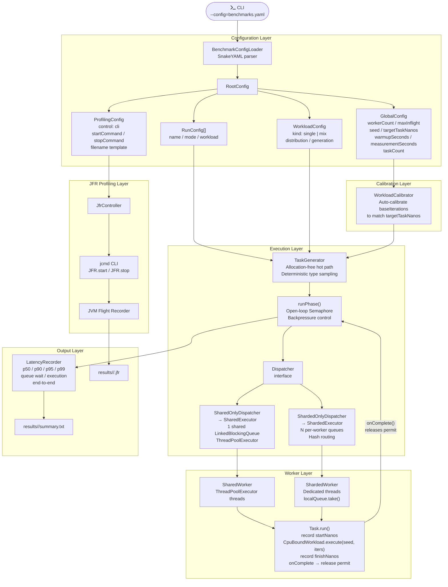
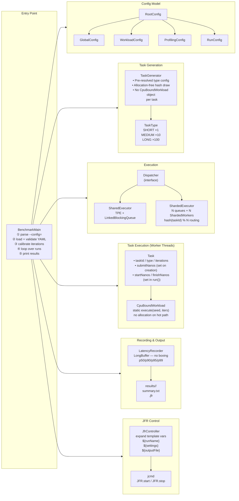
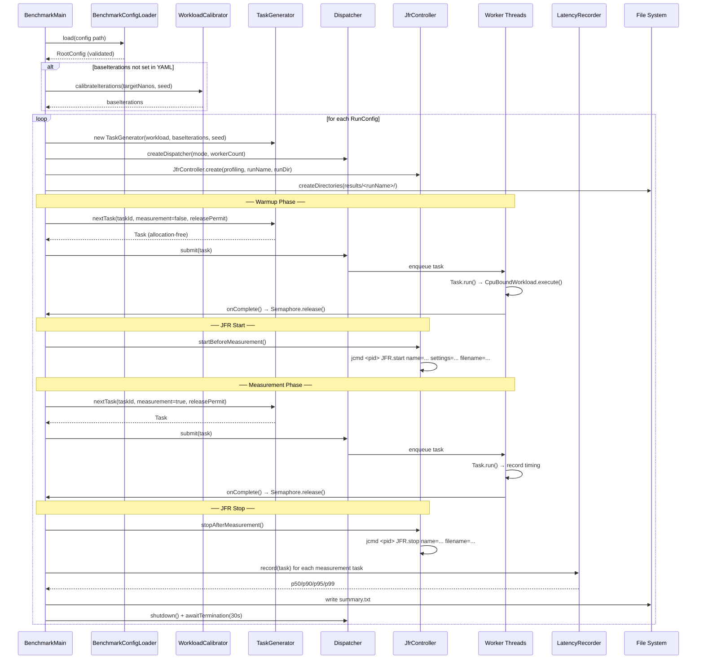
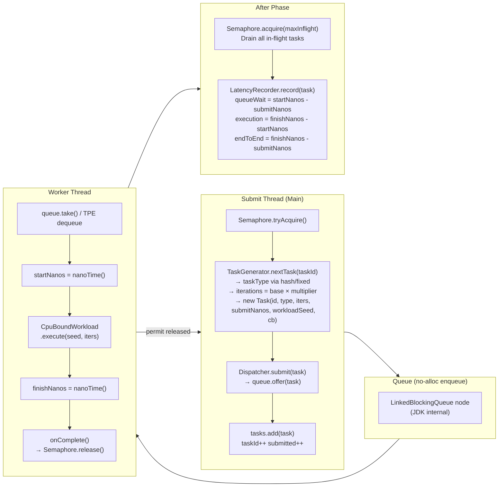
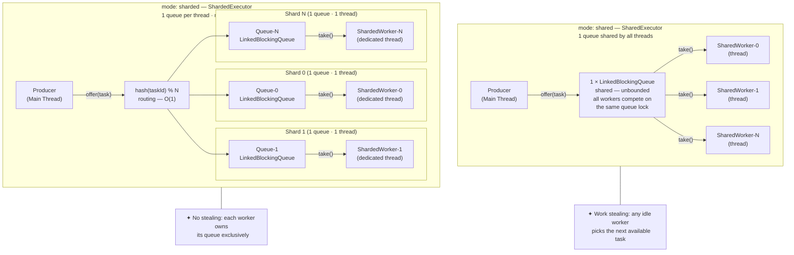
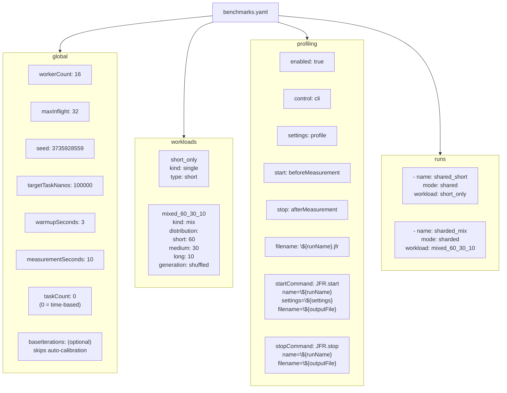

# System Architecture

## High-Level Architecture

---

## Component Responsibilities

---

## Execution Lifecycle (Sequence)

---

## Data Flow Through the Hot Path

---

## Queue Topology Comparison

---

## YAML Config Structure

