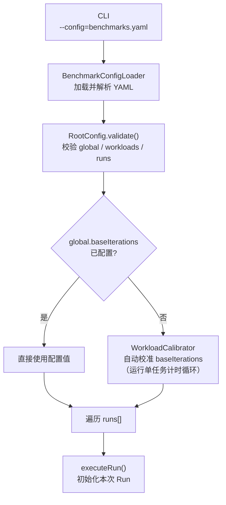
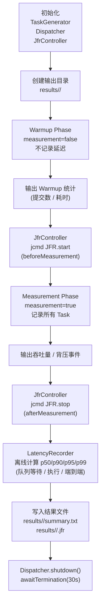
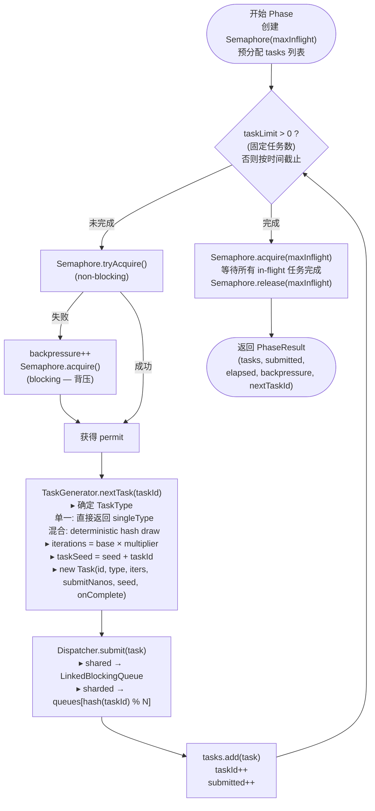
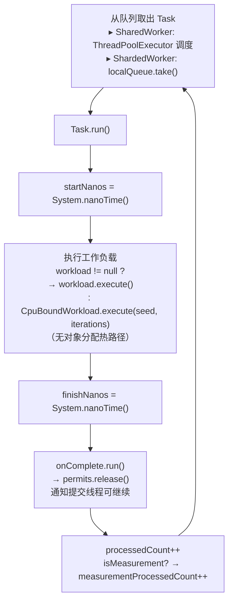
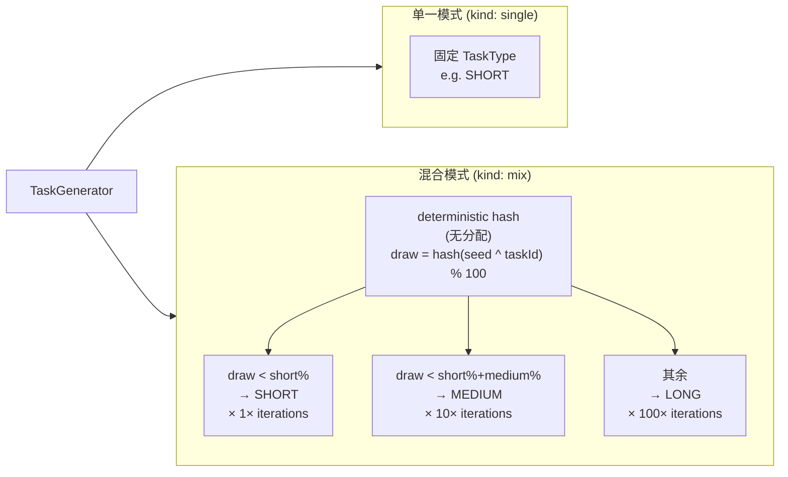
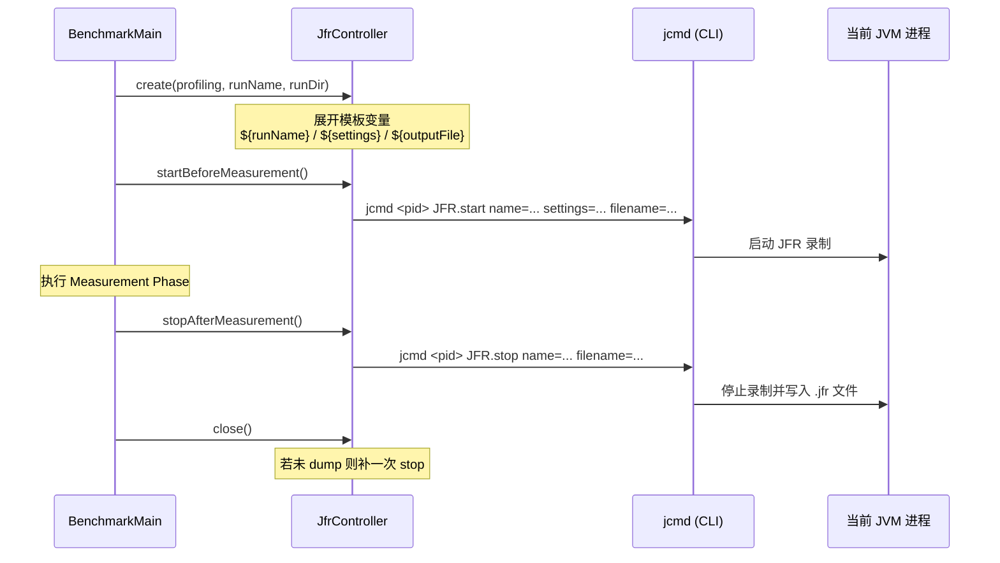
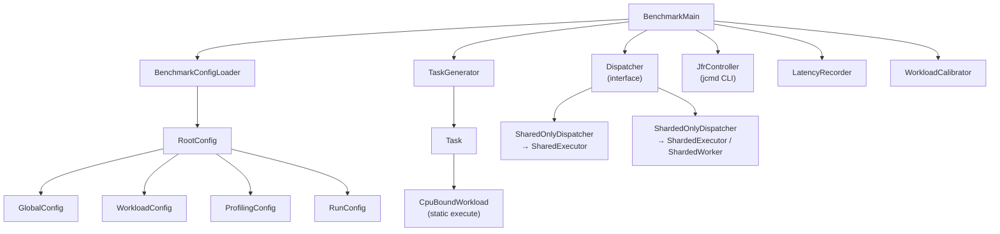

# System Workflow

## 整体流程图



---

## 单次 Run 执行流程



---

## runPhase 提交线程热路径



---

## Worker 线程执行路径



---

## TaskType 与负载分配



---

## JFR 命令行控制



---

## 输出文件结构

```
results/
└── <runName>/
    ├── summary.txt        # 文字摘要：配置、吞吐量、p50/p90/p95/p99
    └── <runName>.jfr      # JFR 录制文件（profiling.enabled=true 时生成）
```

`summary.txt` 内容：

```
runName=shared_short
mode=shared
workload=short_only
submitted=100000
durationSeconds=10.012
throughput=9988.0 tasks/s
backpressureEvents=42

Recorded tasks: 100000

Metric             p50        p90        p95        p99
------------------------------------------------------------
Queue wait      0.004 ms   0.010 ms   0.016 ms   0.023 ms
Execution       0.006 ms   0.008 ms   0.008 ms   0.008 ms
End-to-end      0.011 ms   0.017 ms   0.024 ms   0.032 ms
```

---

## 组件依赖关系



